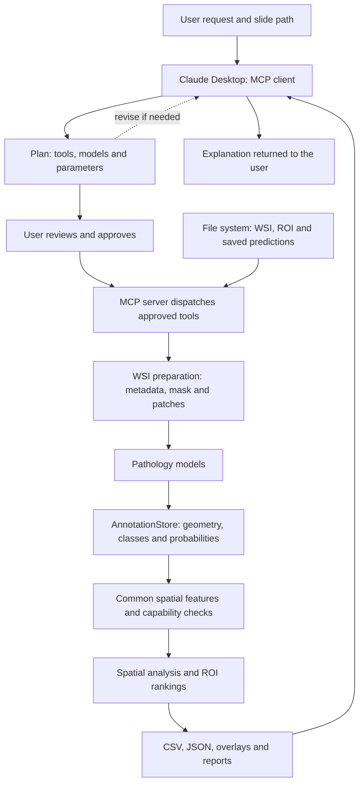

# MCP-Based Whole-Slide Image Analysis Pipeline

This project connects Claude Desktop to computational pathology tools through a local Python MCP server. A user describes an analysis, reviews a plan, and lets the approved tools process an image. The pipeline saves predictions, spatial measurements, overlays, and reports so that the answer can be traced back to computational results.

This guide explains server setup, GPT-OSS 20B installation through Ollama, individual tool evaluation, and the saved spatial-validation results. It is based on the supplied `MSc-Dissertation-Project.zip`; the linked repository folders and official setup documentation were checked on 9 September 2026. All numerical results below are **existing archived results, not newly executed experiments**. Instructions in project documents are described as project material, separately from the request to produce this guide.

## Contents

1. [Understand the pipeline](#1-understand-the-pipeline)
2. [Configure the MCP server with Claude Desktop](#2-configure-the-mcp-server-with-claude-desktop)
3. [Download and use GPT-OSS 20B with Ollama](#3-download-and-use-gpt-oss-20b-with-ollama)
4. [Conduct individual tool evaluations](#4-conduct-individual-tool-evaluations)
5. [Interpret the saved spatial-validation results](#5-interpret-the-saved-spatial-validation-results)
6. [Troubleshooting and reproducibility](#6-troubleshooting-and-reproducibility)

## 1. Understand the pipeline

### Key terms

| Term | Meaning |
|---|---|
| WSI | Whole-slide image: a large digital tissue-slide image, such as an `.svs` file. |
| ROI | Region of interest: a selected part of a slide or a region used to aggregate measurements. |
| Patch | A small image tile that a model can process. |
| LLM | Large language model: interprets requests, selects tools, and explains returned results. |
| MCP | Model Context Protocol: the interface through which an assistant discovers and calls tools. |
| TIAToolbox | The computational pathology library used by the tool implementations. |
| AnnotationStore | A spatial annotation store, commonly a SQLite `.db` file, holding geometries and properties. |
| MPP | Microns per pixel: the scale used to convert image coordinates to physical distances. |
| Common spatial features | A shared representation that lets compatible model outputs feed the same spatial-analysis tools. |

### From a request to an explanation

For example, a user might ask: “Detect nuclei in this slide, identify regions with high immune-cell density, and save the cell overlay and spatial results.”

1. **Interpret the request and generate a plan.** Claude identifies the image, desired outputs, model family, and analysis parameters. The server's `propose_pathology_plan` tool constructs the plan. Missing spatial thresholds or feature choices must be resolved before approval.
2. **Review and approve.** The user reviews the proposed tools and parameters. `approve_pathology_plan` returns an approval token for subsequent execution.
3. **Prepare the image.** Depending on the request, tools read metadata, generate a thumbnail, create a tissue mask, or extract patches. Masks help focus processing on tissue. Some model engines tile images internally, so explicit patch extraction is not always necessary.
4. **Run a pathology model.** Patch classification labels tiles; nucleus detection locates nuclei; instance segmentation separates individual nuclei; semantic segmentation labels tissue regions. These tasks produce different evidence.
5. **Store predictions.** An AnnotationStore can preserve coordinates or geometries, class predictions, and probabilities where available.
6. **Prepare spatial features.** Compatible predictions are converted into a common object/ROI representation. Capability checks determine which analyses the available data support. Tissue-region predictions do not automatically provide individual-cell measurements.
7. **Calculate spatial measurements.** Tools compute neighbourhoods, co-occurrence, nearest distances, Cross-G, entropy, Moran's I, point-pattern statistics, or ROI rankings.
8. **Save and explain results.** Claude receives structured results and file paths. Users inspect CSV/JSON files, reports, and overlays in a compatible viewer such as TIAViz.



If your viewer does not render Mermaid, read the flow as **request → approved plan → image preparation → predictions → spatial measurements → saved outputs → explanation**. This follows the supplied architecture figure. Its coloured cells and region maps represent model-derived results; their meanings depend on the class mapping and legend.

### Repository layout

Paths below are relative to the extracted repository root unless explicitly shown as absolute examples.

```text
MSc-Dissertation-Project/
├── files_mock_claude_response/
│   ├── tiatoolbox_mcpserver.py
│   ├── tia_tools.py
│   └── claude_desktop_config.json
├── evaluation/evaluation/
│   ├── run_tool.py
│   ├── tasks/
│   ├── fixtures/
│   ├── slurm/
│   ├── logs/
│   └── results/
├── gpt-oss/gpt-oss/
│   ├── runtime/
│   └── evaluation/alignment_evaluation/
│       ├── run_evaluator.py
│       ├── workflows/
│       ├── requirements/
│       ├── evaluator/
│       └── evaluation_results/
└── common_validation_complete_with_local_csv_two_folder_view/
    ├── inputs/
    └── outputs/
```

The doubled `evaluation/evaluation` and `gpt-oss/gpt-oss` directories are present in the archive. Older scripts contain paths written for a flatter checkout; the evaluation section explains the necessary adaptation.

## 2. Configure the MCP server with Claude Desktop

### How the server works

`tiatoolbox_mcpserver.py` implements line-delimited JSON-RPC over **standard input/output (stdio)**. Claude Desktop starts the server as a child process. No HTTP server address or listening port is required for this connection.

| Protocol operation | Purpose |
|---|---|
| `initialize` | Establish the MCP session. This implementation declares protocol version `2025-06-18`. |
| `tools/list` | Return tool names, descriptions, and JSON input schemas. |
| `tools/call` | Validate/dispatch the requested tool and return its result or error. |

The server imports computational functions from `tia_tools.py`. Protocol handling, planning, and execution checks live in the server; the image and spatial calculations live in the tool module. This implementation handles MCP directly rather than using FastMCP.

Long-running model calls can launch separate prediction jobs. `check_prediction_job` retrieves their status. A job being accepted is not proof of completed predictions: wait for its final status and inspect the output artifacts.

Plan approval requires the exact confirmation string `I approve this plan`. The server checks the resulting token, authorized tools, and applicable parameter bindings. Pending and approved plans are held in process memory, so restarting the server clears them. These are implementation details of the pipeline, not approval requirements for reading archived files or this guide.

### Prepare Python

Extract the archive or obtain the [GitHub project](https://github.com/rohit123465/MSc-Dissertation-Project). If using Git, retrieve Git LFS content when an expected image/binary is only a small pointer file.

Create a dedicated environment. The archived spatial validation used Python 3.12.10 and TIAToolbox 2.1.2; the separate GPU functional tests used Python 3.12.13 and TIAToolbox 2.1.0. The inspected project does not provide a single dependency lockfile, so the following is an installation starting point, not an exact reproduction of both environments.

Example in **PowerShell**, replacing the project path:

```powershell
Set-Location "C:\Projects\MSc-Dissertation-Project"
py -3.12 -m venv .venv
.\.venv\Scripts\python.exe -m pip install --upgrade pip
.\.venv\Scripts\python.exe -m pip install "tiatoolbox==2.1.2" esda libpysal pointpats
.\.venv\Scripts\python.exe -m pip check
```

Different tool paths also use NumPy, SciPy, Shapely, OpenCV, Matplotlib, scikit-learn, tifffile, timm, and PyTorch. Some are installed through TIAToolbox dependencies. Confirm that your chosen model engines and native slide-reading libraries are available. Consult the [TIAToolbox installation guide](https://tia-toolbox.readthedocs.io/en/latest/installation.html) and [PyTorch installation selector](https://pytorch.org/get-started/locally/) for platform-specific requirements and a GPU-compatible build.

From the project root, check the environment:

```powershell
.\.venv\Scripts\python.exe -c "import torch, tiatoolbox; print(tiatoolbox.__version__); print(torch.__version__); print('CUDA:', torch.cuda.is_available())"
.\.venv\Scripts\python.exe -c "import sys; sys.path.insert(0, 'files_mock_claude_response'); from tia_tools import tool_health; print(tool_health())"
```

Keep `tiatoolbox_mcpserver.py` and `tia_tools.py` together. A successful health check does not establish that every model engine or CUDA works. Pathology-model weights may download on first use; these are separate from GPT-OSS weights.

### Add the Claude Desktop configuration

Open **Claude Desktop → Settings → Developer → Edit Config**. Typical locations are:

| Platform | File |
|---|---|
| Windows | `%APPDATA%\Claude\claude_desktop_config.json` |
| macOS | `~/Library/Application Support/Claude/claude_desktop_config.json` |

Add this entry with your actual absolute paths. Merge it into an existing `mcpServers` object if necessary. This follows the [official MCP local-server setup guide](https://modelcontextprotocol.io/docs/develop/connect-local-servers).

```json
{
  "mcpServers": {
    "tiapathology": {
      "command": "C:\\Projects\\MSc-Dissertation-Project\\.venv\\Scripts\\python.exe",
      "args": [
        "-u",
        "C:\\Projects\\MSc-Dissertation-Project\\files_mock_claude_response\\tiatoolbox_mcpserver.py"
      ]
    }
  }
}
```

`command` points to the environment's Python executable; `args` points to the server script. `-u` disables Python output buffering. Escape Windows backslashes in JSON. On macOS, use an absolute `.venv/bin/python` path and server path.

Use this minimal entry instead of copying the entire archived configuration, which includes the original user's unrelated application preferences. Quit Claude Desktop completely and reopen it.

### Verify and start a workflow

Ask Claude: “Call the tiapathology health tool and show the result.” Confirm that the tool actually executes.

Then try a small slide:

> Propose a nucleus-detection workflow for `C:/Projects/MSc-Dissertation-Project/CMU-1-Small-Region.svs`. Explain the model and outputs before execution, and save outputs in a new run directory.

Review the plan, supply missing choices, and approve it. Spatial workflows may need class mappings, distance units, MPP, radii, probability thresholds, ROI size, and statistic-specific parameters. If a TIFF/GeoJSON ROI pair requires validation, the implemented workflow validates the exact pair before later processing.

The file must be accessible to the machine running the server. A Linux cluster path is not automatically accessible to a Windows server launched by Claude Desktop.

## 3. Download and use GPT-OSS 20B with Ollama

### What GPT-OSS does here

The [gpt-oss/gpt-oss folder](https://github.com/rohit123465/MSc-Dissertation-Project/tree/main/gpt-oss/gpt-oss) contains an Ollama runtime and a recorded-workflow **alignment evaluator**.

| Component | Role |
|---|---|
| Claude Desktop + MCP | Plans and executes pathology workflows. |
| TIAToolbox models | Process tissue images. |
| GPT-OSS + Ollama | Judges whether recorded workflow evidence satisfies the original request. |

Downloading GPT-OSS does not replace Claude Desktop's model or automatically connect GPT-OSS to the MCP tools. `run_evaluator.py` sends evidence to Ollama's `/api/chat`; it does not execute the pathology pipeline.

The bundled `runtime/bin/ollama` and `.so` libraries are Linux components. Windows users should install the Windows Ollama application.

### Install and download

Install Ollama from the [official download page](https://ollama.com/download), following the [quick-start guide](https://docs.ollama.com/quickstart) or [Linux installation instructions](https://docs.ollama.com/linux).

With Ollama running:

```text
ollama --version
ollama pull gpt-oss:20b
ollama list
ollama run gpt-oss:20b
```

Ask a short question to confirm generation; enter `/bye` to leave the chat. The [20B listing](https://ollama.com/library/gpt-oss:20b) identifies an approximately 13 GB download. Runtime memory also depends on context length and CPU/GPU allocation; download size is not the full memory requirement.

If Ollama is not already running, start `ollama serve` in another terminal. Avoid launching a second server on an occupied port. The default endpoint is `http://127.0.0.1:11434`; `ollama ps` shows loaded models and processor allocation. See the [Ollama FAQ](https://docs.ollama.com/faq).

The saved experiment environment records GPT-OSS 20B, Ollama 0.33.2, Python 3.9.25, and an NVIDIA A10 with 23,028 MiB. This describes that experiment's machine, not a universal minimum.

### Optional project-local weight storage

Running `ollama pull` from the project directory does not itself put weights there. Set `OLLAMA_MODELS` on the **Ollama server process** to choose the storage location.

For a manually started Windows server, quit the existing Ollama app first, then run:

```powershell
$env:OLLAMA_MODELS = "C:\Projects\MSc-Dissertation-Project\gpt-oss\gpt-oss\models"
ollama serve
```

Run `ollama pull gpt-oss:20b` in a second terminal. For the desktop app, set the user environment variable and restart the application. On Linux, a manually launched process can use:

```bash
export OLLAMA_MODELS="/absolute/path/MSc-Dissertation-Project/gpt-oss/gpt-oss/models"
ollama serve
```

A system service needs its environment configured in the service settings. Setting a client-terminal variable does not change an already-running server. See [Ollama environment configuration](https://docs.ollama.com/faq).

### Run the alignment evaluator

The archived quick-start and script default refer to **120B**. Explicitly pass **`--model gpt-oss:20b`** for the requested model.

Use a separate working copy of `gpt-oss/gpt-oss/evaluation/alignment_evaluation`, or preserve its existing results first. The runner starts at `run_01.json` on each invocation and overwrites matching filenames.

From that working copy, run one smoke test:

```text
python run_evaluator.py --task-id T001 --model gpt-oss:20b --runs 1
```

Inspect `evaluation_results/T001/run_01.json`. Preserve the smoke-test record separately before running five recorded judgments:

```text
python run_evaluator.py --task-id T001 --model gpt-oss:20b --runs 5 --temperature 0.2 --seed 42000
```

The supplied runner uses a 16,384-token context, a 4,096-token generation limit, a default 1,800-second timeout, and incrementing seeds 42000–42004 for those five runs. Use `--base-url http://127.0.0.1:PORT` for a non-default local endpoint.

Each task combines:

| Input | Purpose |
|---|---|
| `requirements/T001_requirements.json` | Request-derived checklist. |
| `workflows/T001.json` | Recorded request, tool activity, outputs, and final response. |
| `evaluator/evaluator_prompt_v1.txt` | Rubric sent to the judging model. |
| `evaluator/evaluator_output_schema_v1.json` | Requested structured output format. |

Keep missing evidence explicitly missing rather than reconstructing success from filenames. The evaluator produces requirement judgments, dimension scores, confidence, justification, and an overall label: `FULLY_SUCCESSFUL`, `PARTIALLY_SUCCESSFUL`, or `FAILED`.

`status: "valid"` means the output passed the runner's basic judgment checks, not that the workflow succeeded. These checks cover selected required fields, task ID, and label; they are not full independent schema/factual validation. The script can exit with code zero after writing error records, so inspect each record's `status`, `error`, and `judgment`. It writes individual runs but does not generate the archived per-task `summary.json` files.

## 4. Conduct individual tool evaluations

### Scope of the runner

The [evaluation/evaluation folder](https://github.com/rohit123465/MSc-Dissertation-Project/tree/main/evaluation/evaluation) tests Python functions directly through `run_tool.py`. Claude, Ollama, and MCP plan approval are not involved.

The function registry supports exactly two tools, with three task specifications each:

| Tool | Model in the supplied tasks | Output |
|---|---|---|
| `predict_semantic_segmentation` | `fcn_resnet50_unet-bcss` | Tissue-region predictions and an AnnotationStore. |
| `predict_kongnet_nucleus_detection` | `KongNet_PanNuke_1` | Nucleus predictions and an AnnotationStore. |

All supplied tasks request CUDA, batch size 1, one worker, AnnotationStore output, `patch_mode: false`, and `auto_get_mask: false`. Other server tools are not automatically covered.

### Adapt the nested layout

The runner sets:

```python
WORKSPACE_ROOT = Path(__file__).resolve().parents[1]
SOURCE_ROOT = WORKSPACE_ROOT / "files_mock_claude_response"
```

At `evaluation/evaluation/run_tool.py`, `parents[1]` is the outer evaluation folder, not the repository root. To retain the archived layout, change the first assignment in your working copy to:

```python
WORKSPACE_ROOT = Path(__file__).resolve().parents[2]
```

This guide documents the correction; the archived code has not been modified. Then make these task-specific adjustments:

1. Replace `/dcs/22/...` input paths with actual local paths.
2. Correct `semantic_002.json`, whose `task_id` is mistakenly `semantic_001`.
3. Use unique run directories and update `output_json_path`, `save_dir`, and `expected.required_files` consistently.
4. Confirm CUDA availability if retaining `device: "cuda"`. A supported CPU run requires an explicit device change and should be reported as a different configuration.

| Task | Input named in the task | Where to obtain it in the archive |
|---|---|---|
| `semantic_001` | `nucleii.ome.tif` | `evaluation/evaluation/fixtures/` |
| `semantic_002` | `roi.ome.tif` | Nested fixtures folder or repository root |
| `semantic_003` | `CMU-1-Small-Region.svs` | Repository root |
| `kongnet_001` | `demo.ome.tif` | Repository root |
| `kongnet_002` | `wsi4_12k_12k.svs` | Repository root |
| `kongnet_003` | `Zoomed.ome.tif` | Supply the original image; it is absent from the expected location in the inspected archive. |

Using a different image creates a new test condition, not an exact reproduction.

### Example adapted task and command

After correcting the root assignment, save this as `evaluation/evaluation/tasks/semantic_001_local.json`:

```json
{
  "task_id": "semantic_001_local",
  "function": "predict_semantic_segmentation",
  "arguments": {
    "wsi_path": "evaluation/evaluation/fixtures/nucleii.ome.tif",
    "output_json_path": "evaluation/evaluation/results/semantic_001_local/run_summary.json",
    "model_name": "fcn_resnet50_unet-bcss",
    "batch_size": 1,
    "device": "cuda",
    "save_dir": "evaluation/evaluation/results/semantic_001_local/annotationstore",
    "output_type": "annotationstore",
    "patch_mode": false,
    "auto_get_mask": false,
    "num_workers": 1,
    "overwrite": false
  },
  "expected": {
    "required_files": [
      "evaluation/evaluation/results/semantic_001_local/run_summary.json"
    ],
    "require_annotationstore": true
  }
}
```

Run from the repository root:

```powershell
.\.venv\Scripts\python.exe evaluation/evaluation/run_tool.py --task evaluation/evaluation/tasks/semantic_001_local.json
```

For KongNet, adapt its JSON in the same way while retaining `predict_kongnet_nucleus_detection` and `KongNet_PanNuke_1`. Repeat for each available input. Use a fresh directory per run. The example uses `overwrite: false`; the original tasks use `overwrite: true`.

### Judge the outcome

The runner checks that required files exist and are nonempty, parses required JSON files, and finds at least one nonempty `.db` under `save_dir`. It writes `evaluation_result.json` beside the requested output JSON, recording arguments, function results, runtime, and environment.

| Status | Meaning |
|---|---|
| `passed` | Function returned and the configured file checks passed. |
| `failed_validation` | Function returned but expected artifacts failed checks. |
| `execution_error` | Execution/device validation raised an exception. |
| `task_configuration_error` | Task parsing, input paths, or argument preparation failed. |

Under the corrected root, configuration errors go to `evaluation/results/configuration_errors/evaluation_result.json`. Import failures may occur before that error handling and appear only in the terminal.

A nonempty `.db` is a basic artifact check, not validation of its contents. Open it and inspect annotation geometry, class properties, and the overlay. Fresh directories avoid an old database satisfying a new run's checks.

These are **functional tests**, not accuracy measurements against labelled ground truth. Dice, IoU, and detection precision/recall require a separate labelled dataset and evaluation implementation.

### Slurm execution

The two `.slurm` files are original university-cluster templates. Both currently select their `_003` task; neither automatically runs all three cases.

Adapt `PROJECT_DIR`, `VENV_DIR`, `TASK_FILE`, the runner path, log paths, partition, GPU request, and module settings to your environment and nested layout. Create log directories before submission because Slurm may open logs before script execution. Save scripts with Unix line endings.

```bash
sbatch evaluation/evaluation/slurm/semantic_segmentation.slurm
sbatch evaluation/evaluation/slurm/kongnet_detection.slurm
```

The templates include a CUDA/cuDNN convolution preflight. Their `unset LD_LIBRARY_PATH` addresses a documented conflict between older cluster libraries and the environment's CUDA 13 PyTorch build; it is an environment-specific workaround, not a universal setup step.

### Archived functional-test results

The six per-task result records are marked `passed`:

| Result directory | Recorded runtime, seconds |
|---|---:|
| `semantic_001` | 32.91 |
| `semantic_002` | 29.18 |
| `semantic_003` | 47.03 |
| `kongnet_001` | 86.79 |
| `kongnet_002` | 240.20 |
| `kongnet_003` | 106.53 |

They record Linux, TIAToolbox 2.1.0, PyTorch 2.12.0+cu130, and an NVIDIA RTX A5000. Earlier logs and a configuration-error record are also present. These are historical runtimes, not predictions for another machine or segmentation-quality scores.

## 5. Interpret the saved spatial-validation results

### What the two folders contain

`common_validation_complete_with_local_csv_two_folder_view` checks calculations using **synthetic inputs with known arrangements**, allowing expected and observed values to be compared.

| File/location | Purpose |
|---|---|
| `inputs/*_input.db` and `*_input.png` | Synthetic annotations and reference images where included. |
| `inputs/*__common_spatial_features.json` | Shared spatial representation for a case. |
| `inputs/*__spatial_objects.csv` | Object coordinates/classes and related fields. |
| `inputs/*__spatial_roi_features.csv` | Aggregated ROI features. |
| `inputs/*__spatial_capabilities.json` | Supported-analysis metadata. |
| `outputs/manifest.json` | Environment, parameters, scope, and source/runner hashes. |
| `outputs/summary.json` | Overall status and detailed case checks. |
| `outputs/summary.csv` | One overview row per case. |
| `outputs/*_summary.csv` | Statistic-specific expected/observed comparisons. |
| `outputs/*_observed.json` | Detailed observed results where produced. |
| `outputs/*_global.json` | Global Moran results. |
| `outputs/*_local.json` and `*_local.csv` | Per-nucleus Local Moran results. |
| `outputs/*_local_overlay.db` | Local-analysis annotations for visualization. |

Some rejection cases are recorded only in the detailed summary. Blank numeric fields may mean “not applicable” or an expected rejection, rather than zero or failure.

The two-folder package reorganizes results, but embedded JSON paths still point to the original machine's `evaluation/out/.../common_inputs/...` layout. Find the corresponding case-prefixed file under `inputs` or `outputs`. Those historical absolute paths are provenance, not portable links; tool reuse may require rebasing them.

### Overall result

The saved summary reports **64 of 64 cases passed**, with a runtime of **13.60 seconds**.

| Family | Cases |
|---|---:|
| Common adapter contract | 1 |
| Common ROI Moran | 1 |
| Common ROI entropy | 1 |
| Common neighbour distances | 1 |
| Nucleus Global/Local Moran patterns and rejection cases | 9 |
| Ripley's K | 8 |
| Cross-G | 12 |
| Nearest-neighbour index | 11 |
| Tumour–immune interaction | 16 |
| Co-occurrence | 4 |
| **Total** | **64** |

The manifest records a 29 August 2026 run, absolute tolerance `1e-9`, and 999 permutations. The main Moran example uses a 10 × 10 grid, spacing 20 pixels, neighbour threshold 21 pixels, and seed 42. Random controls also use seeds 42–46. Differences such as `1.11e-16` are rounding far below the configured tolerance.

### Adapter, entropy, and neighbour distances

The **adapter contract** verifies IDs, class mapping, coordinates, probability filtering, and physical scale. Unmapped numeric classes are rejected when semantic class information is required. This guards against obtaining mathematically correct answers from incorrectly mapped inputs.

The **ROI entropy** case gives `[0, 1, 0, 1]`, exactly as expected. Normalized Shannon entropy is zero for a single-class region and one for equal representation of the two present classes. It measures composition, not the arrangement of cells within a region.

The **neighbour-distance** case uses expected distances of 3 and 4 µm. Observed mean and median are 3.5 µm, minimum 3 µm, maximum 4 µm, with two directed links inside the 5 µm radius.

### Global and Local Moran's I

Moran's I measures whether neighbouring feature values are similar. These nucleus examples encode `Epithelial` as 1 and other classes as 0. Their graph uses truncated exponential distance weights, no self-weights, and row standardization.

| Pattern | Observed global I | Recorded permutation p-value |
|---|---:|---:|
| Grouped | 0.893333 | 0.001 |
| Alternating | -1.000000 | 0.001 |
| Shuffled seed 42 | -0.055000 | 0.261 |
| Shuffled seed 43 | -0.016667 | 0.455 |
| Shuffled seed 44 | 0.070000 | 0.124 |
| Shuffled seed 45 | -0.050000 | 0.330 |
| Shuffled seed 46 | 0.003333 | 0.411 |

The grouped result shows strong positive association: similar class states occur together. The alternating result shows negative association: neighbouring states differ. The shuffled controls have small global associations. The common ROI Moran example separately matches `0.8933333333333333` to numerical precision; ROI and nucleus analyses use different nodes/features even when constructed examples yield the same value.

Global Moran summarizes the entire graph; Local Moran describes individual nuclei. The grouped case has a significant global result but all 100 local labels are `not significant` after adjustment. The alternating case has 50 `low-high` and 50 `high-low` adjusted labels. Global significance does not require every location to be locally significant.

Read the local CSV as follows:

| Columns | Meaning |
|---|---|
| `nucleus_id`, `predicted_type`, `probability` | Identity and supplied prediction properties. |
| `selected_class`, `feature_value` | Analysed class and binary encoding. |
| `x`, `y`, `distance_units` | Position and units; these Moran examples use pixels. |
| `standardized_feature_value`, `spatial_lag` | Standardized value and weighted neighbour feature. |
| `local_moran_i` | Local association statistic. |
| `p_value`, `adjusted_p_value` | Raw and Benjamini–Hochberg-adjusted p-values. |
| `quadrant`, `raw_cluster_label`, `cluster_label` | Pattern category and significance-filtered labels. |
| `neighbour_count`, `neighbour_ids` | Neighbours used for that calculation. |
| `computation_status` | Whether calculation was possible. |

`High-high` means a high feature value surrounded by high values; `low-low` is its low-valued counterpart. `High-low` and `low-high` indicate local contrast. These labels describe the encoded feature, not tissue grade.

`zero_variance` and `no_neighbours` pass because invalid computations are appropriately rejected. The manifest explicitly excludes p-value calibration from validation scope. Some shuffled controls have locally significant labels, so these results are not proof of calibrated false-positive rates.

### Ripley's K

Ripley's K measures neighbours within different radii, normalized by observation area and point count. The eight cases use area 10,000 µm², MPP 0.5, radii 2.5, 5, 7.5, 15, and 150 µm, `n*(n-1)` normalization, and **no edge correction**.

All pass. The square case gives K = 0 at 2.5 µm, 6,666.6667 µm² at 5 µm, and 10,000 µm² from 7.5 µm onward. Clustered points have more close pairs than regularly spaced points at small radii. At 150 µm, every pair is included, so all cases reach the area value of 10,000 µm² under this estimator.

These are numerical/controlled-behaviour checks. Edge effects and large-radius saturation matter when interpreting real-slide curves.

### Cross-G

Cross-G asks: **what fraction of source cells have their nearest target cell within radius r?** It is a cumulative fraction between 0 and 1, and source-to-target direction matters.

All 12 cases pass. The hand example gives `1/3` at 1 µm, `2/3` at 2 µm, and 1 at 5 µm. The near case reaches 1 at 2 µm. The separated case stays zero through 25 µm and reaches 1 at 150 µm. Many-to-one/one-to-many examples check directionality; self-exclusion prevents a cell becoming its own nearest neighbour.

The missing-target case validates insufficient-input handling, not an ordinary zero curve. The scope covers empirical curves, nearest distances, and the CSR expression, not significance validation.

### Nearest-neighbour index (NNI)

NNI compares observed mean nearest-other-point distance with the expected mean under the specified complete-spatial-randomness (CSR) reference:

```text
NNI = observed mean nearest distance / (0.5 × sqrt(area / n))
```

All 11 cases pass. The regular pattern has NNI **1.7778**, the clustered pattern **0.1111**, and random patterns approximately **0.9615–1.0819**. Below 1 means shorter spacing than this reference; above 1 means longer spacing.

Doubling the physical scale doubles the relevant distances but leaves NNI at 1.7778. Duplicates produce zero distance and NNI zero. A single-point case checks insufficient input because no other point exists.

### Tumour–immune interaction measures

These are proximity-based summaries of supplied classes, not direct measurements of biological interaction:

```text
interaction_strength = 100 × qualifying tumour–immune pairs / total ROI cells
contact_fraction = qualifying tumour–immune pairs / (tumour count × immune count)
```

All 16 cases pass. Close cells yield strength 100; separated cells yield zero. Pairs exactly at the 10 µm radius are included, while pairs beyond it are excluded.

The `interaction_above_100` case yields **150**, correctly: strength is **pairs per 100 ROI cells**, not a percentage of cells. One cell can participate in several pairs. Contact fraction has a different denominator: all possible cross-class pairs.

Other cases cover missing classes, epithelial fallback, mixed targets, dilution, random inputs, and ROI boundaries. The boundary case confirms that this ROI calculation excludes a pair spanning two regions.

### Co-occurrence

Co-occurrence counts unordered pairs inside a radius, grouped by class combination; each pair is counted once. All four cases pass:

| Case | Expected and observed pairs |
|---|---|
| Hand example | 3: one A–A and two A–B |
| Exactly at radius | 1 |
| Beyond radius | 0 |
| Three classes | 5: two A–B, two A–C, one B–C |

Unlike Cross-G, co-occurrence may count several targets for one source. Cross-G asks whether the nearest target is close enough.

### What these results establish

The records support numerical agreement, common-format preservation, graph/class alignment, and boundary/rejection behaviour on the supplied synthetic cases. They do not establish pathology-model accuracy, clinical utility, real-slide generalization, or calibrated significance.

The manifest records this `tia_tools.py` SHA-256:

```text
a4c7b3a07ca311976fbb7d6e2c15bd3b6b19ff66e9edb4011d62c20625cd37a4
```

The supplied archive's `tia_tools.py` hashes to:

```text
93ff11a3351dbd2c0e65c3bebfc221d3cdf95d1eae389dc5f0d2f223a3ca1251
```

They are not byte-identical, so these historical results should not be described as a fresh validation of the supplied source. The complete synthetic-validation runner is absent from the inspected archive; only its hash is recorded. Exact regeneration needs the original runner, matching source, and dependency versions. `run_tool.py` does not regenerate these 64 spatial cases.

## 6. Troubleshooting and reproducibility

Keep the three evaluation questions separate:

| Evaluation | Question |
|---|---|
| Direct pathology-tool tests | Does the function execute and produce expected files? |
| Synthetic spatial validation | Do calculations match controlled expectations? |
| GPT-OSS workflow evaluation | Does the recorded workflow satisfy the user request? |

A pass in one does not imply a pass in the others. Preserve requests, parameters, source hashes, input identities, environment, logs, and output artifacts for every new run. Use separate directories and state any deviations from the archived setup.

| Symptom | Action |
|---|---|
| No tools in Claude | Check configuration JSON, absolute paths, Python environment, and restart Claude fully. |
| Server exits | Run the same interpreter/script in a terminal and inspect the traceback. |
| Server appears idle | A stdio server normally waits for JSON-RPC input. |
| Corrupted protocol responses | Keep JSON-RPC on stdout and ordinary diagnostic logs on stderr. |
| Approval rejected | Check plan state, authorized tools, and bound parameters; restarting clears tokens. |
| Prediction not complete | Inspect `check_prediction_job` and saved error/log files before downstream analysis. |
| `No module named tia_tools` | Correct the nested runner's root/source path. |
| Missing image | Replace historical paths and verify the fixture exists. |
| CUDA unavailable | Check the environment, driver/build, and GPU allocation. |
| Ollama connection refused | Start Ollama or correct `--base-url`. |
| Evaluator requests 120B | Explicitly pass `--model gpt-oss:20b`. |
| Invalid evaluator output | Inspect saved status/error/raw content and context/output limits; preserve failed runs. |
| Implausible spatial distances | Check pixel/micron units, MPP, coordinate frame, and class mapping. |
| Broken saved-result paths | Rebase historical paths to the two-folder package's case-prefixed files. |

Begin with the health check and one small-image functional test. Then inspect an approved end-to-end workflow's artifacts before sending its recorded evidence to GPT-OSS for evaluation.
